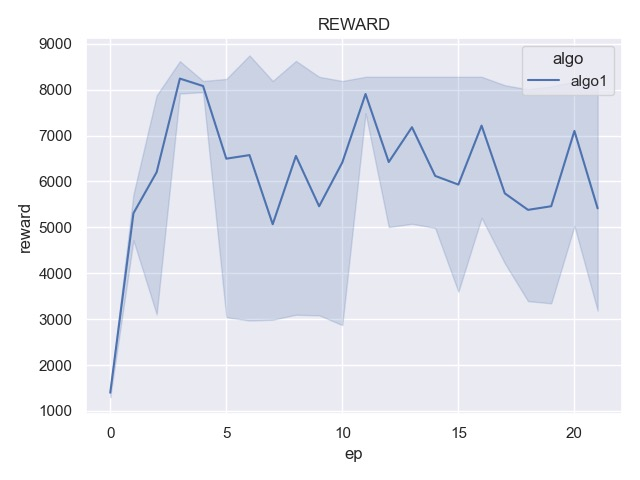
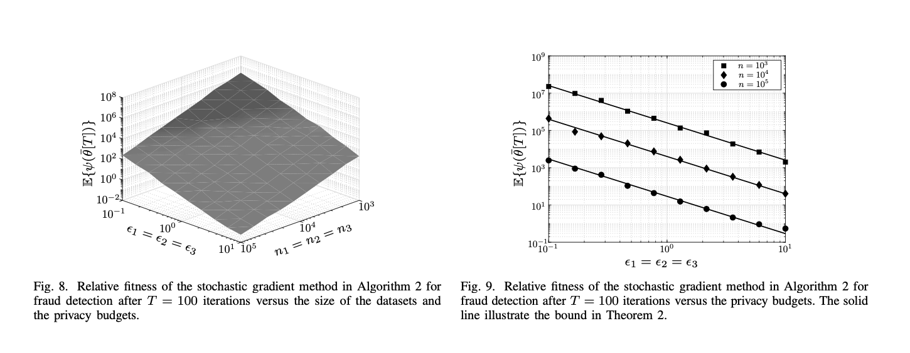
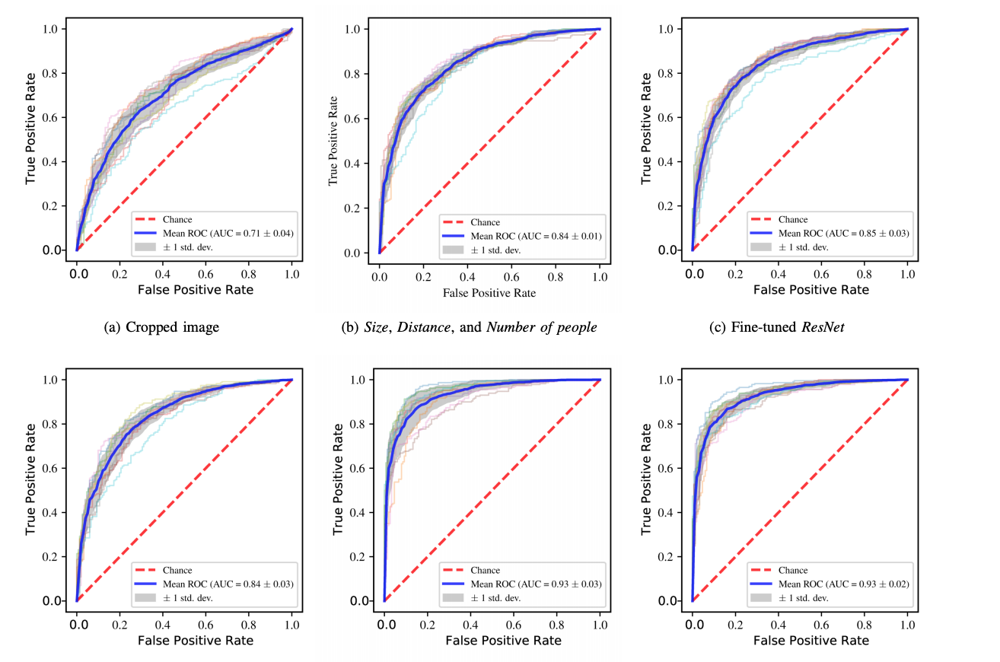
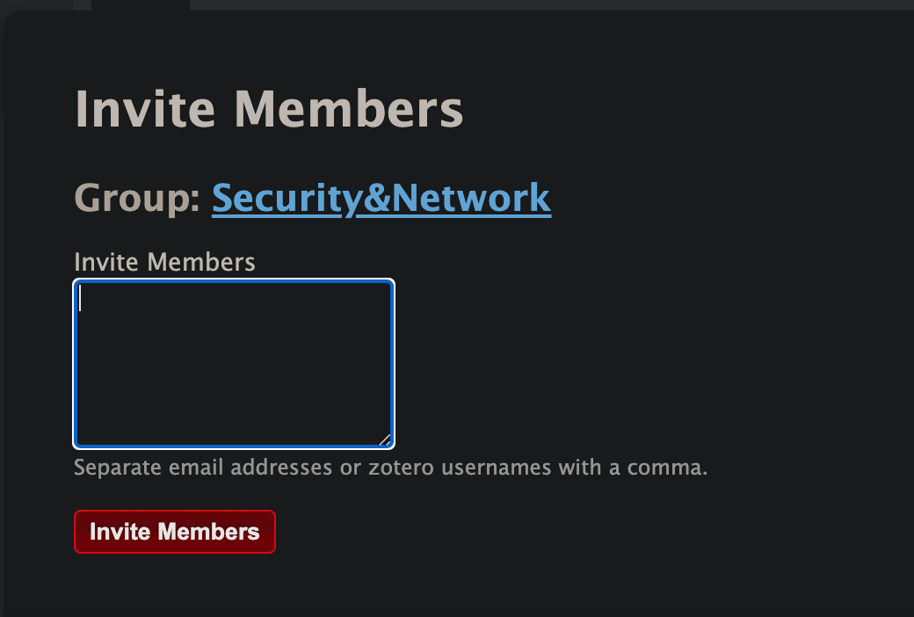

本周工作
1. 更改reward函数并完成绘图

- 针对一个服务器进行攻击，总结过还是跟之前类似，不稳定，怀疑是训练次数太少。

目前没有想到当前模型下如何更好的提供网络安全需求指标

看了一些会议的强化学习的解决办法，很多人提供了 $\epsilon$ 和梯度变化这种曲线






1. Zotero 工作小组初步完成建立

- 完成了Zotero工作小组的建立

需要邮箱或名称拉入成员


没有将之前的笔记完成好整理。

# 完成docker镜像制作
- 想使用google云服务，训练数据，但最后因为信用卡申请没批下来无果。但做好了docker镜像，封装需要的库并加入了代码。
# docker 使用教程

## docker-images 镜像使用

- docker 内所有内容本质都被封装为镜像进行使用，镜像中包含系统所有内容对于任意用户都可以从仓库中下载镜像并在本机器运行。

下面是一些命令行指令
```linux
# docker images // 展示当前所有镜像

# docker rmi <name>// 移除镜像 + 名称

# docker push <name>// 上传镜像

# docker commit -m "what you do" <container ID> <image name>
```

## docker-container 容器使用

- docker 中的容器可以被理解为虚拟机，你可以指定这个运行的虚拟机在后台或者前台，执行某种命令，此外你也可以将此虚拟机打包为镜像方便他人执行。

下面是一些命令行指令
```linux
# docker run [options] image[:tag|digest] [command] [ags...]

// 一般状态下采用如下方式进行执行
# docker run -itd --name="ubuntu_01" -v /Users/lancer/docker_volume:/from_host ubuntu /bin/bash

// 可以使用如下命令进行查看所有执行过的容器

# docker ps -a

// 后台运行的容器可以使用如下方式进入
# docker attach <ID or NAME>

// 重启停止的容器
# docker restart <ID or NAME>

// 终止容器
# docker stop <ID or NAME>

// 使用如下命令即使退出也不会影响容器的运行
# docker exec -it <image name> /bin/bash
```

# 研究了paddlepaddle

没找到能直接移植keras的办法，所以最后还是选择了google服务器（提供免费试用）