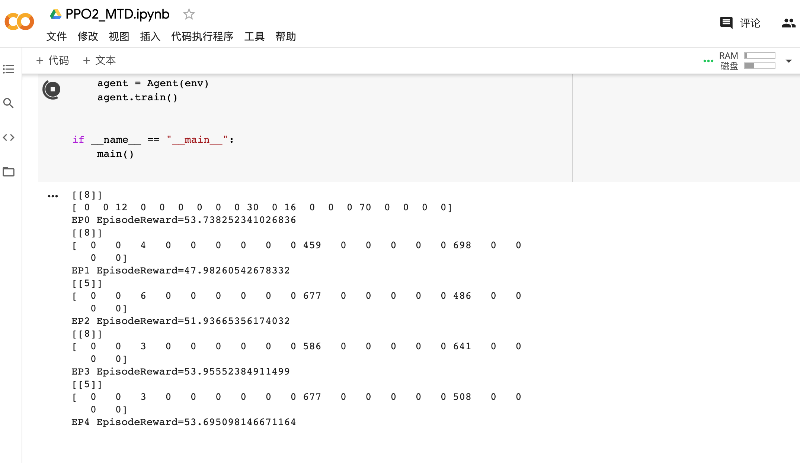

# 完成云计算

使用 google 云存储 `colab notebook` 提供的免费GPU算力进行计算，解决了本地主机计算速度缓慢的问题

未解决问题，如何实时传递出值包括：预测值，服务器状态等值的变化。

# 探究 PPO 和 PPO2

完成代码阅读和运行，在运行测试用例，可以收敛，我的模型暂时不可以收敛。

没有找到原因。

最大的问题在于应该如何设定奖励值的大小。

# 附图-云计算


```python
#!/usr/bin/env python
# -*- encoding: utf-8 -*-
"""
@File    :   PPO   
@Contact :   18645369158@163.com

@Modify Time      @Author    @Version    @Desciption
------------      -------    --------    -----------
2020/12/15 2:18   LanceYuan  1.0         None
"""
import wandb
import tensorflow as tf
from tensorflow.keras.layers import Input, Dense

import argparse

import math
import gym
from gym import spaces
import numpy as np
import random


class Sever:
    """
    服务器类：用于完成服务器的定义
    """

    def __init__(self):
        # 攻击次数
        self.prob = 0
        # 展示服务器是否开机 true表示开机 false表示关机
        self.status = True
        # 表示玩家控制服务器 true表示管理员控制 false表示攻击者控制
        self.control = True
        # 创建服务器重启后需要时间步
        self.step_need = 7
        # 距离开机剩余的时间步
        self.time_to_up = 0
        # 防御者观察到prob的次数
        self.find_prob = 0

    def who_win(self):
        """
        判断获胜方
        :return:
        """
        return self.status and self.control

    def reimage_server(self):
        """
        重启服务器
        :return:
        """
        self.status = False
        self.time_to_up += self.step_need
        self.prob = 0

    def pass_time(self):
        """
        随着时间的流逝完成服务器重启任务
        :return:
        """
        if not self.status:
            self.time_to_up -= 1
            if not self.time_to_up:
                self.status = True

    def change_the_control(self):
        """
        更改控制方
        :return:
        """
        self.control = not self.control


class MTD(gym.Env):
    def __init__(self):
        # Environment agents actions
        # 给定时间步
        self.time_step = 0
        # 创建服务器数目
        self.servers_num = 10

        # 防御者没有观测到攻击的可能
        self.no_observing = 0
        # 每次观测增长的经验
        self.prob_knowledge = 0.05
        # 攻击或防御需要花费
        self.cost = 0.20
        # 奖励函数的倾斜
        self.slope = 5
        # 奖励函数极值阈值
        self.steep_point = 0.2
        # 服务器运行攻击者 / 防御者的比值
        self.weighting = 0 / 1
        # reward
        self.reward = float
        # Heuristic Strategies
        # 保护者策略周期
        self.defender_strategies = 4
        # 攻击者策略周期
        self.adversary_strategies = 4
        # PCP调查阈值
        self.prob_threshold = 7
        # threshold for adversary’s / defender’s Control-Threshold strategy
        self.a_div_d_threshold = 0.5 / 0.8

        # severs
        self.servers = []
        for i in range(self.servers_num):
            self.servers.append(Sever())
        # 设置防御者控制区域
        self.control_by_de = set([])
        for i in range(10):
            self.control_by_de = self.control_by_de | {i}
        # 设置初始状态
        self.state = []
        for sever in self.servers:
            one_server = [sever.prob, sever.time_to_up]
            self.state.append(one_server)

        # gym_need
        self.action_space = spaces.Discrete(self.servers_num + 1)

        self.observation_space = spaces.Box(0, 1, shape=(1, 10), dtype=int)

    def adversary_heuristic(self, strategy_type=2):

        if strategy_type == 0:
            # No-OP 不采取任何操作
            return True
        elif strategy_type == 1:
            # Uniform-Uncompromised
            if len(self.control_by_de) == 0:
                return True
            sever = random.choice(list(self.control_by_de))
            if self.servers[int(sever)].status:
                p = self.servers[int(sever)].prob + 1
                self.servers[int(sever)].prob += 1
                # 设置攻击成功的概率
                probility = 1 - math.exp(-self.prob_knowledge * p)
                if np.random.rand() < probility:
                    self.control_by_de = self.control_by_de - {sever}
                    self.servers[int(sever)].change_the_control()
            return True
        elif strategy_type == 2:
            # Control-Threshold
            if 1 in self.control_by_de:
                sever = 1
                p = self.servers[int(sever)].prob + 1
                self.servers[int(sever)].prob += 1
                # 设置攻击成功的概率
                probility = 1 - math.exp(-self.prob_knowledge * p)
                if np.random.rand() < probility:
                    self.control_by_de = self.control_by_de - {sever}
                    self.servers[int(sever)].change_the_control()
            return True
        elif strategy_type == 3:
            # MaxProbe - Uncompromised
            return True

    def sigmoid(self, x):
        """
        sigmoid 函数，用于控制当前控制服务器数量与奖励机制的关系
        :param x: 输入参数
        :return: 1/e^{-sl*(x - th)}
        """
        return 1.0 / np.exp(- self.slope * (x - self.steep_point))

    def step(self, action):
        # 设置断言
        assert self.action_space.contains(action)

        # 服务器经过一个时间步
        for sever in self.servers:
            sever.pass_time()

        # 攻击者行动反应，每次间隔一个时间步(因为防御者每四次动一下，所以环境里按照这样标准默认)
        for i in range(4):
            self.adversary_heuristic(2)

        # 防御者行为, 每次间隔4个时间步
        if action:
            self.servers[action - 1].reimage_server()
            self.control_by_de = self.control_by_de | {action - 1}

        # 统计奖励函数
        # 读取攻击次数
        n_c = 0
        for sever in self.servers:
            if sever.who_win():
                n_c += 1
        # 当明确返回值比例为 1 / 0 时，将 reward 值设为 utility 值， 即 sigmoid 函数与占比相乘
        reward = self.sigmoid(n_c / self.servers_num - 1) / self.sigmoid(self.servers_num / self.servers_num - 1)
        self.time_step += 4

        # 设置当前完成状态
        if self.time_step >= 1000:
            done = True
        else:
            done = False
        # 添加额外信息
        info = {}

        self.state = []
        for sever in self.servers:
            one_server = [sever.prob, sever.time_to_up]
            self.state.append(one_server)
        return np.array(self.state), reward, done, info

    def reset(self):
        # 重建环境
        self.servers = []
        for i in range(self.servers_num):
            self.servers.append(Sever())
        # 设置防御者控制区域
        self.control_by_de = set([])
        for i in range(10):
            self.control_by_de = self.control_by_de | {i}
        self.time_step = 0

        self.state = []
        for sever in self.servers:
            one_server = [sever.prob, sever.time_to_up]
            self.state.append(one_server)

        return np.array(self.state)

    def render(self):
        print(self.state)

    def close(self):
        pass


# 设置keras 后端接口数据
tf.keras.backend.set_floatx('float64')

#wandb.init(name='PPO', project="deep-rl-tf2")


gamma = 0.99
update_interval=5
actor_lr=0.0005
critic_lr=0.001
clip_ratio=0.1
lmbda=0.95
epochs=3


class Actor:
    def __init__(self, state_dim, action_dim):
        self.state_dim = state_dim
        self.action_dim = action_dim
        self.model = self.create_model()
        #
        self.opt = tf.keras.optimizers.Adam(actor_lr)

    def create_model(self):
        return tf.keras.Sequential([
            Input((self.state_dim,)),
            Dense(32, activation='relu'),
            Dense(16, activation='relu'),
            Dense(self.action_dim, activation='softmax')
        ])

    def compute_loss(self, old_policy, new_policy, actions, gaes):
        gaes = tf.stop_gradient(gaes)
        old_log_p = tf.math.log(
            tf.reduce_sum(old_policy * actions))
        old_log_p = tf.stop_gradient(old_log_p)
        log_p = tf.math.log(tf.reduce_sum(
            new_policy * actions))
        ratio = tf.math.exp(log_p - old_log_p)
        clipped_ratio = tf.clip_by_value(
            ratio, 1 -  clip_ratio, 1 +  clip_ratio)
        surrogate = -tf.minimum(ratio * gaes, clipped_ratio * gaes)
        return tf.reduce_mean(surrogate)

    def train(self, old_policy, states, actions, gaes):
        actions = tf.one_hot(actions, self.action_dim)
        actions = tf.reshape(actions, [-1, self.action_dim])
        actions = tf.cast(actions, tf.float64)

        with tf.GradientTape() as tape:
            logits = self.model(states, training=True)
            loss = self.compute_loss(old_policy, logits, actions, gaes)
        grads = tape.gradient(loss, self.model.trainable_variables)
        self.opt.apply_gradients(zip(grads, self.model.trainable_variables))
        return loss


class Critic:
    def __init__(self, state_dim):
        self.state_dim = state_dim
        self.model = self.create_model()
        self.opt = tf.keras.optimizers.Adam(critic_lr)

    def create_model(self):
        return tf.keras.Sequential([
            Input((self.state_dim,)),
            Dense(32, activation='relu'),
            Dense(16, activation='relu'),
            Dense(16, activation='relu'),
            Dense(1, activation='linear')
        ])

    def compute_loss(self, v_pred, td_targets):
        mse = tf.keras.losses.MeanSquaredError()
        return mse(td_targets, v_pred)

    def train(self, states, td_targets):
        with tf.GradientTape() as tape:
            v_pred = self.model(states, training=True)
            assert v_pred.shape == td_targets.shape
            loss = self.compute_loss(v_pred, tf.stop_gradient(td_targets))
        grads = tape.gradient(loss, self.model.trainable_variables)
        self.opt.apply_gradients(zip(grads, self.model.trainable_variables))
        return loss


class Agent:
    def __init__(self, env):
        self.env = env
        a = self.env.observation_space
        self.state_dim = 2 * self.env.observation_space.shape[1]
        self.action_dim = self.env.action_space.n

        self.actor = Actor(self.state_dim, self.action_dim)
        self.critic = Critic(self.state_dim)

    def gae_target(self, rewards, v_values, next_v_value, done):
        n_step_targets = np.zeros_like(rewards)
        gae = np.zeros_like(rewards)
        gae_cumulative = 0
        forward_val = 0

        if not done:
            forward_val = next_v_value

        for k in reversed(range(0, len(rewards))):
            delta = rewards[k] +  gamma * forward_val - v_values[k]
            gae_cumulative =  gamma *  lmbda * gae_cumulative + delta
            gae[k] = gae_cumulative
            forward_val = v_values[k]
            n_step_targets[k] = gae[k] + v_values[k]
        return gae, n_step_targets

    def list_to_batch(self, list):
        batch = list[0]
        for elem in list[1:]:
            batch = np.append(batch, elem, axis=0)
        return batch

    def train(self, max_episodes=1000):
        for ep in range(max_episodes):
            state_batch = []
            action_batch = []
            reward_batch = []
            old_policy_batch = []

            episode_reward, done = 0, False

            state = self.env.reset()

            while not done:
                probs = self.actor.model.predict(
                    np.reshape(state, [1, self.state_dim]))
                action = np.random.choice(self.action_dim, p=probs[0])

                next_state, reward, done, _ = self.env.step(action)
                state = np.reshape(state, [1, self.state_dim])
                action = np.reshape(action, [1, 1])
                next_state = np.reshape(next_state, [1, self.state_dim])
                reward = np.reshape(reward, [1, 1])

                state_batch.append(state)
                action_batch.append(action)
                # 如何确定
                reward_batch.append(reward * 0.01)
                old_policy_batch.append(probs)

                if len(state_batch) >= update_interval or done:
                    states = self.list_to_batch(state_batch)
                    actions = self.list_to_batch(action_batch)
                    rewards = self.list_to_batch(reward_batch)
                    old_policys = self.list_to_batch(old_policy_batch)

                    v_values = self.critic.model.predict(states)
                    next_v_value = self.critic.model.predict(next_state)

                    gaes, td_targets = self.gae_target(
                        rewards, v_values, next_v_value, done)

                    for epoch in range(epochs):
                        actor_loss = self.actor.train(
                            old_policys, states, actions, gaes)
                        critic_loss = self.critic.train(states, td_targets)

                    state_batch = []
                    action_batch = []
                    reward_batch = []
                    old_policy_batch = []

                episode_reward += reward[0][0]
                state = next_state[0]
            print(state)
            print('EP{} EpisodeReward={}'.format(ep, episode_reward))
           # wandb.log({'Reward': episode_reward})


def main():
    env = MTD()
    agent = Agent(env)
    agent.train()


if __name__ == "__main__":
    main()

```