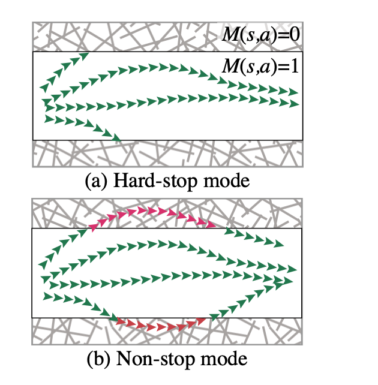
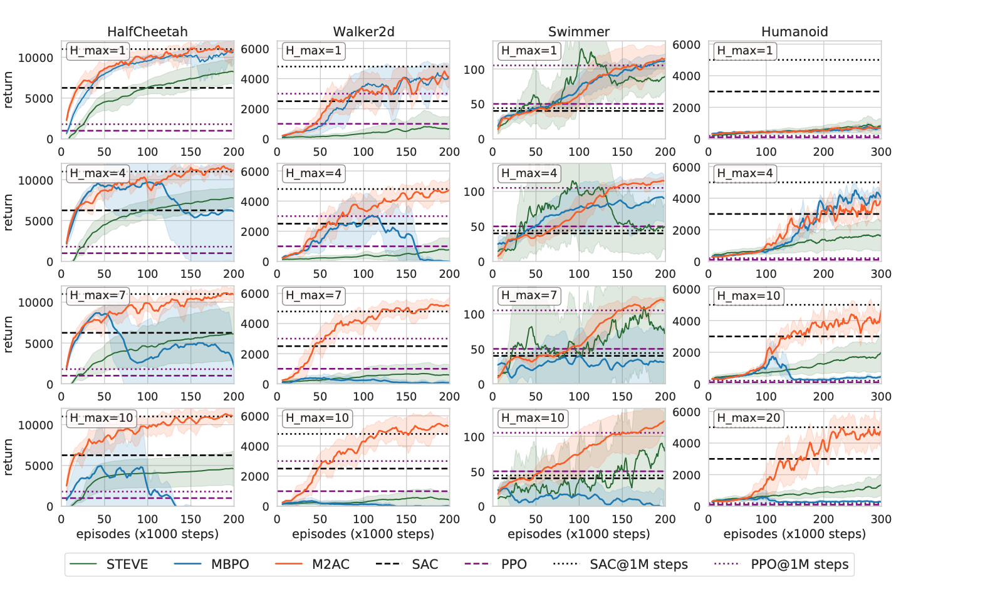
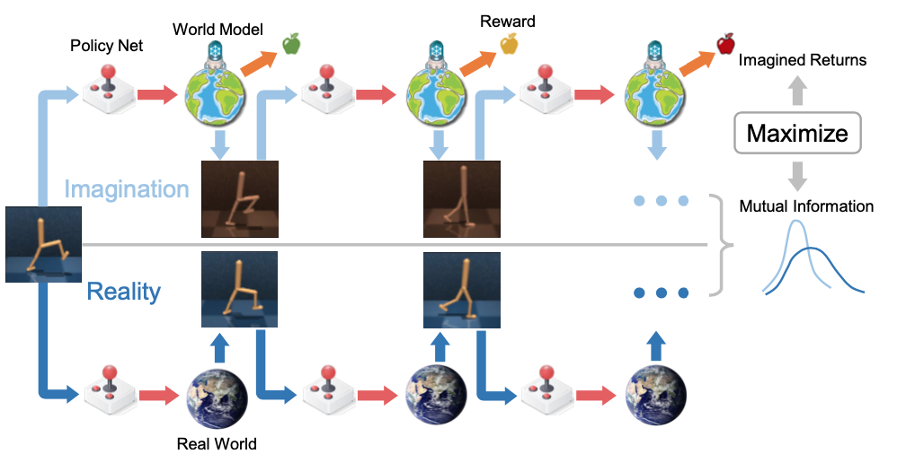
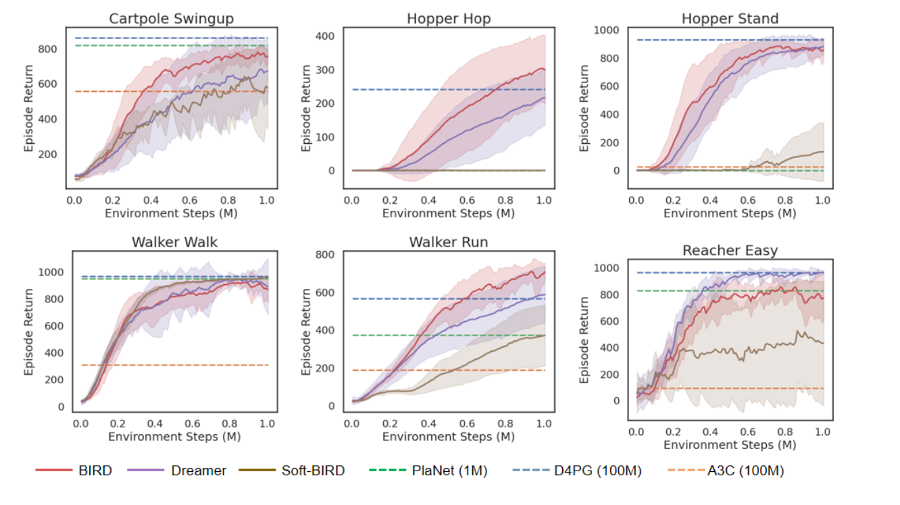
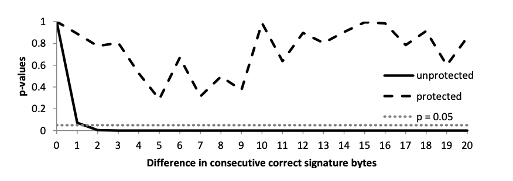
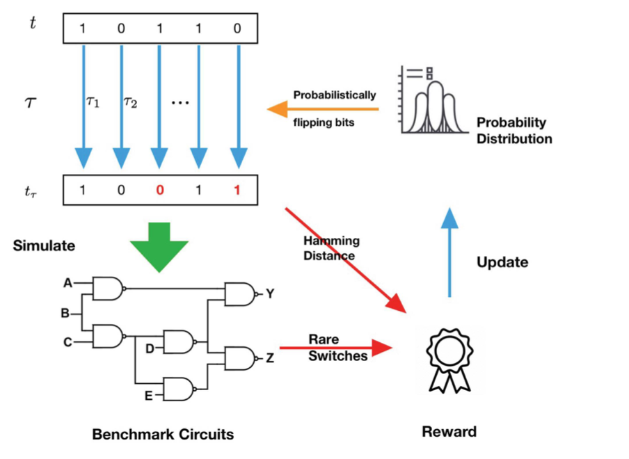
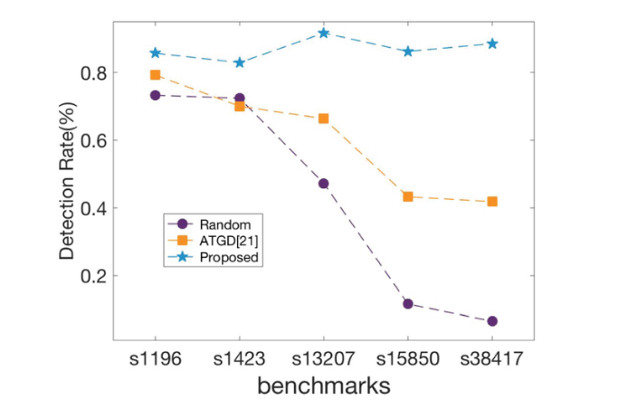
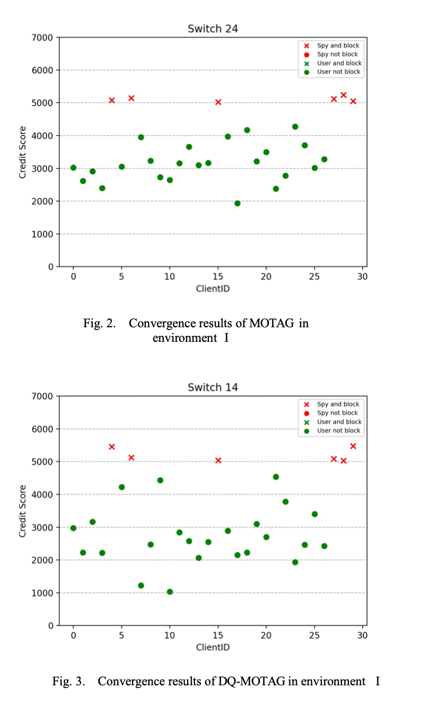
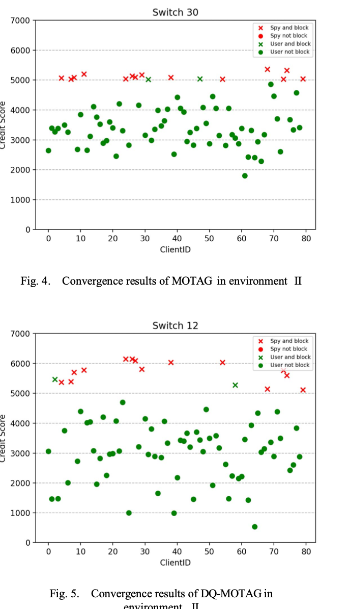
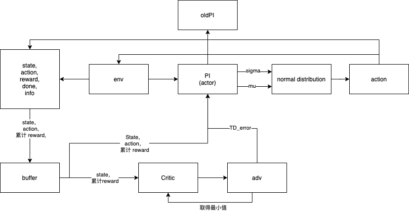

# 论文阅读
## Trust the Model When It Is Confident: Masked Model-based Actor-Critic
创新点：
本文提出了 `Masked Model-based Actor-Critic (M2AC)`
一种策略优化算法，可以最大化真值函数下界。

实现方法：`masking mechanism` - 掩膜机制 模型具有 `uncertainty`

内容概述：
基于模型的强化学习存在一个是否可信的问题，虽然相比于基于无模型的强化学习，样本效率更高，但是在实际情况中，正确率是不确定的 - `It does not know when to trust the model`。
对于有模型问题来说，模型的用法可能造成巨大的影响。
本篇文章使用 M2AC 策略优化算法，取得真值函数下界的最大值。

以往的基于模型的方法取得最好成绩的是 `MBPO`，相比于其他的无模型方法来说，使用样本量更少，效果接近。但是存在不知道什么时候相信模型`when to trust the model`

总体实现思路，使用01掩膜对模型部分是否可信进行判断，能信则信。

实现结果和作图：
掩膜图像：

不同算法间RETURN值对比：

样本效率：

## Bridging Imagination and Reality for Model-Based Deep Reinforcement Learning
创新点：基于模型的强化学习是建立世界模型并基于虚拟轨迹进行策略优化，类似人类的“想象”和“规划”，然而世界模型的学习容易过拟合训练轨迹，基于世界模型的价值估计和策略搜索很容易陷入局部最优。

本文提出了一种全新的基于模型的强化学习算法，解决了这种过拟合问题。

内容概述：
他把提前定义的模型称为“想象”，在日常生活中，我们跟踪和回顾我们过去的思想和想象，通过反省来进一步了解我们的内部状态和与外部世界的互动，并据此改变我们的价值观和行为模式。在定义模型的时候本文定义了一个 `现实感知模型框架` 来优化现实和想象的互信息 `optimizing mutual information between imaginary and real trajectories`.
使得在现实感知模型框架中的策略优化过程也会考虑到与真实世界的差异性及各种可能轨迹的置信度，因此从虚拟轨迹中学习到的策略提升可以很容易地推广到真实轨迹上。

一方面，作者们利用解析梯度方法对策略函数进行优化 (Policy Improvement)，使得其在世界模型中的虚拟轨迹上获得最高的预测收益。另一方面，作者们最大化了虚拟轨迹和真实轨迹之间的互信息 (Mutual Information)，使得虚拟轨迹尽可能真实。

实验结果和作图：

## Adaptive Compiler Strategies for Mitigating Timing Side Channel Attacks

创新点：在传统的侧信道防卫技术当中，可以使用静态的改变编码规则，例如延缓编译时间等。然而现有的编译器技术静态特征带来了一定的缺陷，转化的效率依赖于管道的细节。为了解决此问题，本文提出了一套自适应的编码规则。

文章实现评测方式：通过模拟数字签名的过程
观看本论文主要因为想知道对于侧信道防御技术好坏的评估作图：

实验结果及作图：
这里P代表保护，表示在连续的签名空间中保护的程度，p-值高于0.05表示攻击者无法区分它们

## Test Generation using Reinforcement Learning for Delay-based Side-Channel Analysis
> ICCAD
创新点：本文使用了强化学习技术对基于时延的侧信道分析技术进行了研究。 现有的时延的侧侧信道分析技术主要采用人工规则。

文章内容概述：
本文使用侧信道分析，对木马进行探究，主要对硬件进行研究，由于使用了强化学习技术，所以在这里也进行展示一下。

实现结果及作图：

## DQ-MOTAG: Deep Reinforcement Learning-based Moving Target Defense Against DDoS Attacks

创新点：使用强化学习技术实现移动目标防御针对 DDos 攻击。

文章内容概述：本文跟我们研究的内容很相似，虽然发表的会议不是很出名，但本身的作图和文字值得借鉴。

本文没有做REWARD 或者 RETURN 的图，但是本文针对实际解答问题进行作图。

比较了传统方法和基于深度学习方法的区别

# PPO 分析
PPO 算法的本质是找到一个 $\mu$ 和 $\sigma$
获得一个正态分布分布

