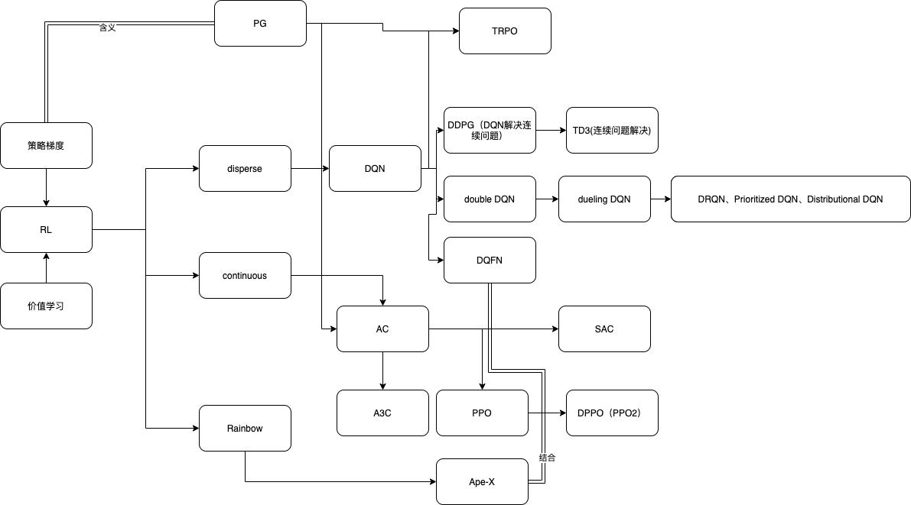

# 完成任务汇总
## 1. 整理文献及发展脉络图



整理了部分文献（还有一部分文献没有整理出来，基本把核心算法都呈现了）

## 2. 看了一个强化学习2020年的会议

[Deep Learning State of the Art (2020) | MIT Deep Learning Series](https://www.youtube.com/watch?v=0VH1Lim8gL8&t=157s)

在会议里主要看到了一个好用的库，还看到了在文本识别等领域的一些技术。

[算法实现网站](https://github.com/hill-a/stable-baselines)
Deep Mind 实验室封装了一些好用较为新颖的可以直接调用的训练方法。


## 3. 关于上次说的论文查询

我现在采用的方法是 [google scholar](https://scholar.google.com/) + [sci-hub](https://sci-hub.shop/) 找到DOI进行解析，如果有些文章不确定DOI 我会去查一下 [Crossref](https://www.crossref.org/) 基本期刊上的文章都能搞定。

会议上的文章就有点麻烦了，主要是很多文章参会不是很清楚，会议也没有提供额外的索引方式，所以很多会议的文章只能根据[CCF](https://www.ccf.org.cn/Academic_Evaluation/By_category/)推荐的会议入手，看往年的会议进行查询。大部分时候我回去[NASA](https://ui.adsabs.harvard.edu/)的论文库上先搜索一下，这个上面有部分会议文章发表的会议。

对于某本论文集或者某次会议上可能发表了某些文章，我会用[dblp](https://dblp.uni-trier.de/)搜索指定会议和论文集比较快。

在选取文章上，我会参考一些blog上的建议文献，根据此文献的引文进行定向搜索（例如 rainbow 算法，这个使用各种算法综合进行训练的算法有很多引文）

看一个文章好不好除了CCF我一般还会衡量[guide2research](http://www.guide2research.com/).

对于一些特殊的会议（比较出名的）我会到[Proceedings of Machine Learning Research](http://proceedings.mlr.press/) 这个学报上下载pdf 因为有的时候Google scholar 总是扔到arxiv 有的作者arxiv上的不是最新版。

## 4. 这周我在写PPO之前，重新看了一遍自己之前写的DQN发现了如下问题：

### DQN 网络问题
1. Epsilon 值只在第一次训练中有更改，也就是只有第一次存在随机性

见 `ActionStateModel` 类, `self.get_action` 函数

2. reward 到 value 的转换直接进行了乘0.01的操作太过草率

见 `agent` 类 ， `train` 函数


### 针对问题1的衍生问题
当设置结束条件为循环1000次的时候只有第一次echo是有效的，只有第一次epsilon是可能存在随机的（现在的参数设置，1.0 0.995 0.1 只能随机生成450次左右）
第二次循环后，产生的action行为完全根据神经网络的预测。

### 针对问题 2 的衍生问题
第一训练时如何进行的，在DQN当中，训练是这样进行的即：

随机生成执行位置  

将 状态 行为 奖励值（这里的奖励值应该如何描述？） 下一个产生的状态 是否完成写入缓冲区

缓冲区里现在的情况不是好的，是随机的。

训练时，随机抽取缓冲区内数据

x_train : 随机抽取的状态

y_train(target): 当前某一个状态的准确值（？ 不一定是准确值，是某一个状态下reward的值和在预测网络中随机的下一个状态的最大可能性值）和其他状态的随机值 

有没有学到东西呢？

有的，每一次学习，神经网络都会知道当在某一个状态（x）下我执行了某种特定操作（其他操作仍然随机）此时执行这个操作的价值大概有多少，但是此时其他的可能性仍然是随机的，很有可能大过现在的状态。
 
综合两个问题

在完成第一次前，神经网络并没有进行训练，此时神经网络是随机连接的，是不具有数据给出能力的。

此时在缓冲区中加入了这样的数据，即随机探索得到的数据。

根据随机探索得到的数据，我们训练了神经网络，让他知道某种状态下，执行特定操作的可能性大致是多少，但是仍然存在这样的问题：
缺少当前这个状态其他可能性的。

当训练完网络进入第二次循环后，网络预测的结果可能存在两种可能性：

1. 随机：因为网络随机产生的随机action 这样的action存在参考意义，因为还可以对神经网络的价值存在影响。（探索）
2. 已知：知晓了某种action对当前的学习存在最大价值那么之后每次处于这个妆态都会执行次命令。（因为除了神经网络外，随机性已经消失了）

假设训练了足够多的次数，填补了每个status下应该采取的状态 action 这样的action 高度依赖于当前状态的执行结果

并且存在这样的问题： 有可能在训练中，使得当前这个状态一定会执行某种其实实际上效果不好的命令（因为随机的时候生成这个最大了）

### 问题概括

综上所属，解决问题1的合理办法是使epsilon的尝试变得尽可能的多，尽可能的丰满可能性的action取值，使agent不断的探索。并更改结束判断条件，不给结束设定次数结束，而是采取某种方式结束。

问题2的问题，是找到reward 和价值（价值的高低可以决定选择，如果开始的价值太高会造成模型会过度依赖这个价值）的比例关系，保证reward 足够的小，能够优先执行随机的命令。


### 解决方案

1. 修改gym环境结束规则，让gym变得有规则可言，同时为了方便训练，减少服务器数量，精简环境。
2. 修改reward 产生的价值大小，尽可能让随机可能执行。

## 5. 杂项

在剩余时间，研究了一下tf2.0提供给python的API 之前对tensor这个量的纬度概念一直有缺失，梯度下降也不会自己写，自己写了一个mnist-cloth 分类的案例，重新搞了一下基础知识。

## 附录 之前写的DQN代码

```python
#!/usr/bin/env python
# -*- encoding: utf-8 -*-
"""
@File    :   DQN   
@Contact :   18645369158@163.com

@Modify Time      @Author    @Version    @Desciption
------------      -------    --------    -----------
2020/11/21 8:37   LanceYuan  1.0         None
"""
# wandb 可视化工具，可以记录cpu占用和生成相关图谱
import wandb
# 调用 tf 及 keras 接口
import tensorflow as tf
from tensorflow.keras.layers import Input, Dense
from tensorflow.keras.optimizers import Adam

# 绘图相关
import seaborn as sns;
sns.set()
import matplotlib.pyplot as plt
import numpy as np
import pandas as pd

# 调用gym训练场
import gym
# 调用程序提供命令行接口
import argparse
# 调用numpy
import numpy as np
# 引入双向队列
from collections import deque
# 调用随机函数
import random
import os

# 写入csv数据
import csv

# 保存模型
from tensorflow import keras

# 允许副本存在（macos 特殊问题）
os.environ['KMP_DUPLICATE_LIB_OK'] = 'True'
# 设置默认浮点类型（64位）
tf.keras.backend.set_floatx('float64')
# 创建 wandb 库
# wandb.init(name='DQN_attack_one', project="MTD")

# 配置训练需要参数数值
parser = argparse.ArgumentParser()
parser.add_argument('--gamma', type=float, default=0.95)
parser.add_argument('--lr', type=float, default=0.005)
parser.add_argument('--batch_size', type=int, default=32)
parser.add_argument('--eps', type=float, default=1.0)
parser.add_argument('--eps_decay', type=float, default=0.995)
parser.add_argument('--eps_min', type=float, default=0.01)

args = parser.parse_args()

# 使用check_point保存未训练完的模型
check_point_path = "./modle/check_point/DQN_normal.ckpt"
check_point_dir = os.path.dirname(check_point_path)

save_dir = "./modle/save_modle/"
save_epsilon_dir = "./modle/save_epsilon/"

# 建立buffer区存储每步结果
class ReplayBuffer:
    # 初始化区域
    def __init__(self, capacity=10000):
        """
        初始化双向队列
        :param capacity: 最大存储区域
        """
        self.buffer = deque(maxlen=capacity)

    def put(self, state, action, reward, next_state, done):
        """
        置入初始区域
        :param state: 状态
        :param action: 动作
        :param reward: 激励
        :param next_state: 下一步状态
        :param done: 完成与否
        :return:
        """
        self.buffer.append([state, action, reward, next_state, done])

    def sample(self):
        """
        返回随机buffer中样本值
        :return: 返回训练需要的随机样本值
        """
        # 随机给出buffer中的样本值，数目为当前文件的batch_size
        sample = random.sample(self.buffer, args.batch_size)
        # 批量映射转化为 array 类型，并完成矩阵转置
        states, actions, rewards, next_states, done = map(np.asarray, zip(*sample))
        # 将状态转化为一维列矩阵（batch_size行）
        states = np.array(states).reshape(args.batch_size, -1)
        # 将未来状态转化为一维列矩阵（batch_size行）
        next_states = np.array(next_states).reshape(args.batch_size, -1)
        # 返回随机样本值
        return states, actions, rewards, next_states, done

    def size(self):
        """
        返回缓冲区大小
        :return: 返回缓冲区可能大小
        """
        return len(self.buffer)


class ActionStateModel:
    # 状态转化模型
    def __init__(self, state_dim, aciton_dim):
        """

        :param state_dim: 初始化决策纬度
        :param aciton_dim: 初始化决策纬度
        """
        self.state_dim = state_dim
        self.action_dim = aciton_dim
        path_list = os.listdir(save_dir)
        path_list.sort()
        if len(path_list):
            name = path_list[len(path_list) - 1]
            self.model = keras.models.load_model(save_dir + name)
            self.load(name.split(".")[0])
        else:
            # 定义随机变化 epsilon
            self.epsilon = args.eps
            # 创建模型
            self.model = self.create_model()

    def create_model(self):
        """
        模型建立
        :return:
        """
        # 模型叠加
        model = tf.keras.Sequential([
            Input((2 * self.state_dim,)),
            Dense(32, activation='relu'),
            Dense(16, activation='relu'),
            Dense(self.action_dim)
        ])
        # 设置模型编译方式 adaptive moment estimation（适应性矩估计）
        # 损失函数：均方差
        model.compile(loss='mse', optimizer=Adam(args.lr))
        return model

    def predict(self, state):
        """
        模型预测
        :param state:
        :return:
        """
        # 返回模型预测值
        return self.model.predict(state)

    def get_action(self, state):
        """
        获取动作
        :param state:
        :return:
        """
        # state 重建
        state = np.reshape(state, [1, 2 * self.state_dim])

        # 更改 epsilon 数值衰变
        self.epsilon *= args.eps_decay
        # 更新 epsilon 保证
        self.epsilon = max(self.epsilon, args.eps_min)
        test = self.predict(state)
        q_value = self.predict(state)[0]
        # 根据当前 epsilon 值决定返回值
        if np.random.random() < self.epsilon:
            return random.randint(0, self.action_dim - 1)
        # 取出q_value的最大值对应的索引
        return np.argmax(q_value)

    def train(self, states, targets):
        """
        模型训练
        :param states:
        :param targets:
        :return:
        """

        self.model.fit(states, targets, epochs=1, verbose=0)

    def save(self, name):
        """
        保存训练后模型
        :param name:
        :return:
        """
        self.model.save(save_dir + name + ".h5")
        with open(save_epsilon_dir + name + '.txt', 'w') as file:
            file.write(str(self.epsilon))


    def load(self, name):
        """
        读取 epsilon
        :param name:
        :return:
        """
        with open(save_epsilon_dir + name + '.txt', 'r') as file:
            print("正在读取数据epsilon")
            self.epsilon = float(file.read())
            print(self.epsilon)

class Agent:
    def __init__(self, env):
        """
        初始化对象
        :param env:
        """
        # 创建环境及状态对应纬度，动作空间
        self.env = env
        # 获取状态观察纬度
        self.state_dim = self.env.observation_space.shape[1]
        # 获取动作可能区间
        self.action_dim = self.env.action_space.n
        # 创建训练模型
        self.model = ActionStateModel(self.state_dim, self.action_dim)

        # 创建目标模型
        self.target_model = ActionStateModel(self.state_dim, self.action_dim)

        # 模型更新
        self.target_update()
        # 创建动作存储缓冲区
        self.buffer = ReplayBuffer()

    def target_update(self):
        # 将训练好的模型放入 target 中
        weights = self.model.model.get_weights()
        self.target_model.model.set_weights(weights)

    def replay(self):
        """
        使用经验回放进行数据放回 -- 将每次训练结果放入target网络
        :return:
        """
        for _ in range(10):
            # 从缓冲区里取出来随机的行动值
            states, actions, rewards, next_states, done = self.buffer.sample()
            # 取出目标模型中的预测值(batch_size个)
            targets = self.target_model.predict(states)
            # 求得下一个可能的最大values
            next_q_values = self.target_model.predict(next_states).max(axis=1)
            # 对目标的整个返回值进行预测
            targets[range(args.batch_size), actions] = rewards + (1 - done) * next_q_values * args.gamma
            # 使用状态和目标值对当前网络进行继续训练
            self.model.train(states, targets)

    def save(self, name):
        self.model.save(name)

    def train(self, max_episodes=1000):
        """
        训练网络
        :param max_episodes:
        :return:
        """
        with open("number.txt", "r") as file:
            a = file.read()
        if a:
            max_episodes = max_episodes - int(a)
            a = int(a)
        else:
            a = 0
        for ep in range(max_episodes):

            # 设置结束标志及总奖励
            done, total_reward = False, 0
            # 获取初始状态
            state = self.env.reset()

            # 针对一次未结束的训练
            while not done:
                # 获取现在行动
                action = self.model.get_action(state)
                # 获得执行后的实际激励和下个状态
                next_state, reward, done, _ = self.env.step(action)
                # 将值放入buffer区中 每次奖励值缩减
                self.buffer.put(state, action, reward * 0.001, next_state, done)
                # 将总奖励叠加
                total_reward += reward
                # 状态更新
                state = next_state

            # 如果缓冲区满则更新教师网络
            if self.buffer.size() >= args.batch_size:
                self.replay()
            # 更新目标网络
            self.target_update()

            # 输出分步奖励
            print('EP{} EpisodeReward={}'.format(ep, total_reward))


            if (ep + a) % 50 == 0:
                print("正在存储数据")
                self.save("test")
                print("存储成功")

            # 将计算步骤写入程序
            one_step = [ep + a, total_reward]
            with open("test/data1.csv", 'a+') as f:
                csv_write = csv.writer(f)
                csv_write.writerow(one_step)
            with open("number.txt", 'w') as f:
                f.write(str(ep + a))
            # wandb.log({'Reward': total_reward})


def main():
    env = gym.make('MTD-v0')
    agent = Agent(env)
    agent.train(max_episodes=1000)


if __name__ == "__main__":
    main()

```