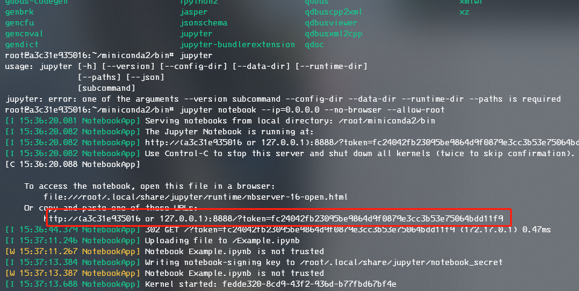

# caffe docker 部署方法

首先，获取官方部署好caffe的容器，启动容器映射端口8888

```
docker run -itd -p 8888:8888 -v `本地位置`:/`映射后菜单名称` `镜像编号` /bin/bash
```

例：

```
docker run -itd -p 8888:8888 -v Users/lancer/docker_volume:/from_host `镜像编号` /bin/bash
```


开启jupyter notebook 远程服务
```
jupyter notebook --ip=0.0.0.0 --no-browser --allow-root
```

启动后会将token（服务位置）告诉用户

例如：



在用户主机浏览器访问

`http://127.0.0.1:8888/`

即可。