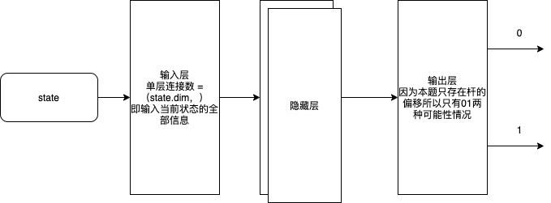
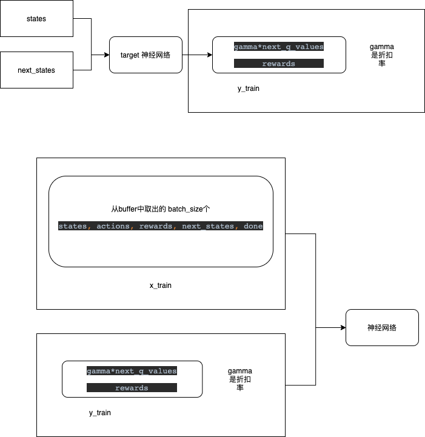
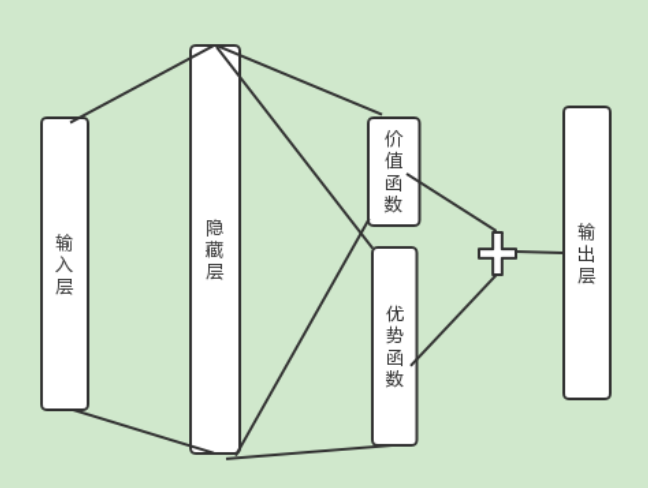
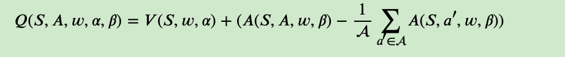

# 本周任务
- 1. 阅读DQN代码、DuelingDQN代码、DRQN代码并做原理解析
- 2. 阅读 docker 容器热迁移并做原理解析
- 3. 阅读论文文献，着重于**论文创新点**、**论文实现使用什么类型网络及原因**、**论文不足**

## 代码阅读

### DQN代码阅读

```python
# wandb 可视化工具，可以记录cpu占用和生成相关图谱
import wandb
# 调用 tf 及 keras 接口
import tensorflow as tf
from tensorflow.keras.layers import Input, Dense
from tensorflow.keras.optimizers import Adam

# 调用gym训练场
import gym
# 调用程序提供命令行接口
import argparse
# 调用numpy
import numpy as np
# 引入双向队列
from collections import deque
# 调用随机函数
import random
import os
# 允许副本存在（macos 特殊问题）
os.environ['KMP_DUPLICATE_LIB_OK']='True'
# 设置默认浮点类型（64位）
tf.keras.backend.set_floatx('float64')
# 创建 wandb 库
wandb.init(name='DQN', project="deep-rl-tf2")

# 配置训练需要参数数值
parser = argparse.ArgumentParser()
parser.add_argument('--gamma', type=float, default=0.95)
parser.add_argument('--lr', type=float, default=0.005)
parser.add_argument('--batch_size', type=int, default=32)
parser.add_argument('--eps', type=float, default=1.0)
parser.add_argument('--eps_decay', type=float, default=0.995)
parser.add_argument('--eps_min', type=float, default=0.01)

args = parser.parse_args()

# 建立buffer区存储每步结果
class ReplayBuffer:
    # 初始化区域
    def __init__(self, capacity=10000):
        """
        初始化双向队列
        :param capacity: 最大存储区域
        """
        self.buffer = deque(maxlen=capacity)
    
    def put(self, state, action, reward, next_state, done):
        """
        置入初始区域
        :param state: 状态
        :param action: 动作
        :param reward: 激励
        :param next_state: 下一步状态
        :param done: 完成与否
        :return:
        """
        self.buffer.append([state, action, reward, next_state, done])
    
    def sample(self):
        """
        返回随机buffer中样本值
        :return: 返回训练需要的随机样本值
        """
        # 随机给出buffer中的样本值，数目为当前文件的batch_size
        sample = random.sample(self.buffer, args.batch_size)
        # 批量映射转化为 array 类型，并完成矩阵转置
        states, actions, rewards, next_states, done = map(np.asarray, zip(*sample))
        # 将状态转化为一维列矩阵（batch_size行）
        states = np.array(states).reshape(args.batch_size, -1)
        # 将未来状态转化为一维列矩阵（batch_size行）
        next_states = np.array(next_states).reshape(args.batch_size, -1)
        # 返回随机样本值
        return states, actions, rewards, next_states, done
    
    def size(self):
        """
        返回缓冲区大小
        :return: 返回缓冲区可能大小
        """
        return len(self.buffer)

class ActionStateModel:
    # 状态转化模型
    def __init__(self, state_dim, aciton_dim):
        """

        :param state_dim: 初始化决策纬度
        :param aciton_dim: 初始化决策纬度
        """
        self.state_dim  = state_dim
        self.action_dim = aciton_dim
        # 定义随机变化 epsilon
        self.epsilon = args.eps
        # 创建模型
        self.model = self.create_model()
    
    def create_model(self):
        """
        模型建立
        :return:
        """
        # 模型叠加
        model = tf.keras.Sequential([
            Input((self.state_dim,)),
            Dense(32, activation='relu'),
            Dense(16, activation='relu'),
            Dense(self.action_dim)
        ])
        # 设置模型编译方式 adaptive moment estimation（适应性矩估计）
        # 损失函数：均方差
        model.compile(loss='mse', optimizer=Adam(args.lr))
        return model
    
    def predict(self, state):
        """
        模型预测
        :param state:
        :return:
        """
        # 返回模型预测值
        return self.model.predict(state)
    
    def get_action(self, state):
        """
        获取动作
        :param state:
        :return:
        """
        # state 重建
        state = np.reshape(state, [1, self.state_dim])
        # 更改 epsilon 数值衰变
        self.epsilon *= args.eps_decay
        # 更新 epsilon 保证
        self.epsilon = max(self.epsilon, args.eps_min)

        q_value = self.predict(state)[0]
        # 根据当前 epsilon 值决定返回值
        if np.random.random() < self.epsilon:
            return random.randint(0, self.action_dim-1)
        # 取出q_value的最大值对应的索引
        return np.argmax(q_value)

    def train(self, states, targets):
        """
        模型训练
        :param states:
        :param targets:
        :return:
        """

        self.model.fit(states, targets, epochs=1, verbose=0)
    

class Agent:
    def __init__(self, env):
        """
        初始化对象
        :param env:
        """
        # 创建环境及状态对应纬度，动作空间
        self.env = env
        # 获取状态观察纬度
        self.state_dim = self.env.observation_space.shape[0]
        # 获取动作可能区间
        self.action_dim = self.env.action_space.n
        # 创建训练模型
        self.model = ActionStateModel(self.state_dim, self.action_dim)
        # 创建目标模型
        self.target_model = ActionStateModel(self.state_dim, self.action_dim)
        # 模型更新
        self.target_update()
        # 创建动作存储缓冲区
        self.buffer = ReplayBuffer()

    def target_update(self):
        # 将训练好的模型放入 target 中
        weights = self.model.model.get_weights()
        self.target_model.model.set_weights(weights)
    
    def replay(self):
        """
        使用经验回放进行数据放回 -- 将每次训练结果放入网络
        :return:
        """
        for _ in range(10):
            # 从缓冲区里取出来随机的行动值
            states, actions, rewards, next_states, done = self.buffer.sample()
            # 取出目标模型中的预测值(batch_size个)
            targets = self.target_model.predict(states)
            # 求得下一个可能的最大values
            next_q_values = self.target_model.predict(next_states).max(axis=1)
            # 对目标的整个返回值进行预测
            targets[range(args.batch_size), actions] = rewards + (1-done) * next_q_values * args.gamma
            # 使用状态和目标值对当前网络进行继续训练
            self.model.train(states, targets)
    
    def train(self, max_episodes=1000):
        """
        训练网络
        :param max_episodes:
        :return:
        """
        for ep in range(max_episodes):
            # 设置结束标志及总奖励
            done, total_reward = False, 0
            # 获取初始状态
            state = self.env.reset()

            # 针对一次未结束的训练
            while not done:
                # 获取现在行动
                action = self.model.get_action(state)
                # 获得执行后的实际激励和下个状态
                next_state, reward, done, _ = self.env.step(action)
                # 将值放入buffer区中 每次奖励值缩减
                self.buffer.put(state, action, reward*0.01, next_state, done)
                # 将总奖励叠加
                total_reward += reward
                # 状态更新
                state = next_state

            # 如果缓冲区满则更新教师网络
            if self.buffer.size() >= args.batch_size:
                self.replay()
            # 更新目标网络
            self.target_update()

            # 输出分步奖励
            print('EP{} EpisodeReward={}'.format(ep, total_reward))
            wandb.log({'Reward': total_reward})


def main():
    env = gym.make('CartPole-v1')
    agent = Agent(env)
    agent.train(max_episodes=1000)

if __name__ == "__main__":
    main()
    
```
#### DQN原理解析
> 概述：DQN 是基于Q-learning（价值学习）之上利用深度神经网络进行实现的深度强化学习网络。

在 Q-leaning 当中我们通过获取建立 `action` 和 `state` 的状态表，获不同状态下的 `quality` 值。

但是，对于Q-table过于大的问题，没办法完成存储。因此，引入了神经网络作为解决办法。

在上述代码中，建立了如下神经网络：




通过训练出如上目标网络，可以根据状态不同给出不同的输出结果。

接下来着重说明训练网络方式。

本文使用两个网络进行训练和更新。

我们称 网络1 为训练使用，此网络在训练中使用
网络 2 为目标网络为最终训练结果在流程图中称其为target网络


### dueling DQN
> 参考：Dueling Network Architectures for Deep Reinforcement Learning 

> [文章链接](http://proceedings.mlr.press/v48/wangf16.html)
```python
def create_model(self):
    backbone = tf.keras.Sequential([
        Input((self.state_dim,)),
        Dense(32, activation='relu'),
        Dense(16, activation='relu')
    ])

    state_input = Input((self.state_dim,))

    backbone_1 = Dense(32, activation='relu')(state_input)
    backbone_2 = Dense(16, activation='relu')(backbone_1)
    
    value_output = Dense(1)(backbone_2)
    advantage_output = Dense(self.action_dim)(backbone_2)
    # 输出层分为价值函数和优势函数
    output = Add()([value_output, advantage_output])
    model = tf.keras.Model(state_input, output)

    model.compile(loss='mse', optimizer=Adam(args.lr))
    return model
```





- 文章核心内容： 内化DQN的本质是建立价值函数和优势函数，通过价值和优势的区分训练增强DQN

### DRQN -- 未完全完成


```python
def create_model(self):
    return tf.keras.Sequential([
        # time_step 多长的步骤可以够成一个序列
        Input((args.time_steps, self.state_dim)),
        LSTM(32, activation='tanh'),
        Dense(16, activation='relu'),
        Dense(self.action_dim)
    ])
```


使用LSTM网络实现循环神经网络原理。

好处，可以使很多 action 作为统一的整体进行考虑。

## docker 学习

- 容器使用（run -it）
- 镜像使用（images）
- docker 热迁移工具（CRIU）

1. 创建checkpoint
2. 导出源容器的镜像文件
3. 复制镜像文件到目的节点
4. 恢复

## 论文阅读
> Adversarial Deep Reinforcement Learning based Adaptive Moving Target Defense
> [论文链接](https://arxiv.org/pdf/1911.11972.pdf)

文章建立了：
multi-agent partially-observable Markov Decision Process model

对弈方式：
攻击者：随时对服务器发起“探测”，这可能损害服务器或增加后续探测的成功概率。目标破坏服务器
防御者：随时“重新映像”服务器

> 阅读文章时存在问题：博弈论很多不知道的东西，解决办法博弈论学习

## 其他学习
- 买了本花书，这两天没事的时候就在看，感觉内容写的很棒，很全，想下周找个时间，用原生的tf入一下门。

网络安全四大顶会：
1. USENIX Security
2. S&P：IEEE Symposium on Security and Privacy
3. CCS：ACM Conference on Computer and Communications Security
4. NDSS： Network and Distributed System Security Symposium