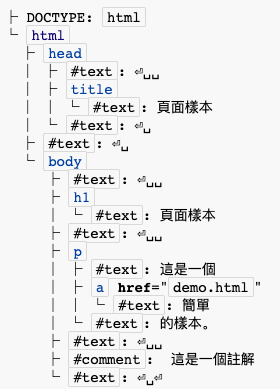

# HTML5

---

author: lanceYuan

tags: HTML

---

## 笔记目的

要写一篇这样博客的目的有很多，H5 语言发展已经很久了，从提出到现在也有 10 多年的时间了，之前听 web 老师讲课，我觉得老师说的挺对的。

浏览器终会成为操作系统，这两天看那些“游戏神器”云电脑，越来越觉得 B/S 模型存在其正确含义。

所以为了迎接 web 时代的到来，写一篇 web 最基本的超文本链接的笔记貌似不过分。

闲言少叙，Here we go！

## HTML5 开放文档提炼内容

> 本博客参考：[W3C-H5 中文文档](https://www.w3.org/html/ig/zh/wiki/HTML5#.E5.AF.B9.E8.B1.A1) and
> [W3Cshcool](https://www.w3school.com.cn/html/index.asp)

### HTML5 背景

讲 H5 的故事我们首先要讲一讲 HTML 的故事，HTML 有自己的英文全称：Hyper Text mqarkuo language

翻译过来就是超文本链接，就是一种显示资源的方法，这个规则从 1990 年开始就开始修改和扩充，但是由于 W3C 官方偏向于制作 XHTML，HTML5 一直没有呗做出来，后来是 Mozilla 和 Opera 从民间制作了 HTML5。其实也不完全是民间的制作，更多程度山上干活时 APPLE、Mozilla、Opera 这些大公司的一场**狂欢盛宴**。

### 简单介绍

先来简单介绍一下 HTML5

```html
<!DOCTYPE html>
<html>
  <head>
    <title>抬头</title>
  </head>
  <body>
    <h1>标题</h1>
    <p>这是<a href="demo.html">超链接</a>的样本</p>
    <!-- 注释 -->
  </body>
</html>
```
我们可以从中看出HTML具有的特点，HTML树的典型特点就是标签的匹配，<>开始</>结束。

每个标签还具有自己的属性：
```html
<!-- 空白属性 -->
<input name=address disabled>
<input name=address disabled="">

<!-- 有值属性 -->
<input name=address maxlength=200>
<input name=address maxlength='200'>
<input name=address maxlength="200">
```
从中我们可以发现引号不是必须的，除诶属性值的本身包含特殊的符号。

我们可以用DOM树（不知道的话问问google）来表示整个HTML的规范：

html（head、body（div（a、p）））

大概是这样的结构。

对于HTML5中的元素，我们可以使用标签<script></script>用js的脚本来操控（大多使用js）我们也会写一片关于js的文章来记录整个的过程。
```javascript
var a = document.links[0]; //链接HTML中第一个链接
a.href = 'sample.html'; //操控链接的属性
a.protocol = 'https';
a.setAttribute('href', 'http://example.com/'); //直接更改属性内容
```
关于js的文章，我们之后还会再更新。

除此意外，在HTML中使用了<style></style>标签，其中放置了CSS用来控制H5的生成。

```CSS
body { background: navy; color: yellow; }
```
可以这样理解：
HTML是框架，CSS是控制每个元素的大小，JS是控制每个元素的活动，大致就是这样。基本介绍到这里结束了，接下来，我们将针对HTML中常见元素为大家介绍H5中的基本元素。

### 打击人的术语
这里必须要介绍一下术语，因为在官方文档里是这么干的，作为一个抄袭者，我不想回来在后面的章节在总结，我们就看看哪些重要的部分，根据这些重要的部分简单总结下术语。
|术语|解释|
|---|---|
|文件物件模型（Document Object Model，DOM）|文件物件模型我们不需要具体的懂得，但我们必须知道HTML DOM是规定HTML所有元素的对象和属性的介绍总和|
|UTF-8|编码形式，HTML统一采用|

### HTML文档的语义与结构
在正式开始HTML标签的学习之前我们需要明确这样的概念，HTML的元素是按照HTML DOM中的定义进行开展的，我们需要探讨好DOM文档中的元素才能更好的了解如何使用HTML。

对HTML的解析需要使用接口转化绑定的办法。
``` java
[OverrideBuiltins]
interface HTMLDocument {
  // 资源元数据管理属性
  [PutForwards=href] readonly attribute Location location;
  readonly attribute DOMString URL;
  //返回文档地址
           attribute DOMString domain;
  readonly attribute DOMString referrer;
  //返回用户导航到此文档对象前所在的 Document 的地址，就是原来在的网站的地址
           attribute DOMString cookie;
  //返回应用于该Document的HTTP cookie。如果没有cookie或者cookie不能用于此资源，则返回空字符串。
  readonly attribute DOMString lastModified;
  //返回文档最近一次修改的时间。该时间由服务器返回，格式为用户本地时区的“MM/DD/YYYY hh:mm:ss”形式。
  readonly attribute DOMString compatMode;
  //显示模式信息，现在基本不用了
           attribute DOMString charset;
  //返回文档的字符编码。
  //可以进行动态改变
  readonly attribute DOMString characterSet;
  //返回文档字符编码
  readonly attribute DOMString defaultCharset;
  //默认编码或者地理位置
  readonly attribute DOMString readyState;
  //判断运行状态，加载时返回“loading”，当解析结束但仍在加载子资源时返回“interactive”，当加载结束返回“complete”。
  // DOM树访问接口
  getter any (in DOMString name);
           attribute DOMString title;
           //如果存在一个文档的title元素，则它是文档中的第一个title元素（在树结构中），否则title元素为null。
           attribute DOMString dir;
           attribute HTMLElement body;
           //
  readonly attribute HTMLHeadElement head;
  //如果存在一个文档的head元素，则它是html元素子元素中的的第一个head元素。否则head元素为null。
  readonly attribute HTMLCollection images;
  //属性必须返回一个根植于Document节点的HTMLCollection，其过滤器仅匹配img元素。
  readonly attribute HTMLCollection embeds;
  //属性必须返回一个根植于Document节点的HTMLCollection，其过滤器仅匹配embed元素。
  readonly attribute HTMLCollection plugins;
  //属性必须返回与embeds属性相同的对象。
  readonly attribute HTMLCollection links;
  //属性必须返回一个根植于Document节点的HTMLCollection，其过滤器仅匹配拥有href属性的a元素和area元素。
  readonly attribute HTMLCollection forms;
  //属性必须返回一个根植于Document节点的HTMLCollection，其过滤器仅匹配form元素。
  readonly attribute HTMLCollection scripts;
  //属性必须返回一个根植于Document节点的HTMLCollection，其过滤器仅匹配script元素。
  NodeList getElementsByName(in DOMString elementName);
  //方法以一个字符串name为参数，并且必须返回一个包含文档树结构中所有特定的HTML元素的活动的（live）NodeList，这些元素的name属性的值与name参数相等（区分大小写）。如果方法被Document对象使用相同的参数重复调用，则用户代理可以返回与之前调用返回值相同的对象。其他情况下，则必须返回一个新的NodeList对象。
  NodeList getElementsByClassName(in DOMString classNames);
  //如果找不到class则返回一个使用空格匹配的class近似的属性，注意符号不可，只能使用空格
  NodeList getItems(in optional DOMString typeNames); // microdata 
  readonly attribute DOMElementMap cssElementMap;

  // 动态标签插入接口
           attribute DOMString innerHTML;
  HTMLDocument open(in optional DOMString type, in optional DOMString replace);
  WindowProxy open(in DOMString url, in DOMString name, in DOMString features, in optional boolean replace);
  void close();
  void write(in DOMString... text);
  void writeln(in DOMString... text);

  // 用户交互接口
  readonly attribute WindowProxy defaultView;
  readonly attribute Element activeElement;
  boolean hasFocus();
           attribute DOMString designMode;
  boolean execCommand(in DOMString commandId);
  boolean execCommand(in DOMString commandId, in boolean showUI);
  boolean execCommand(in DOMString commandId, in boolean showUI, in DOMString value);
  boolean queryCommandEnabled(in DOMString commandId);
  boolean queryCommandIndeterm(in DOMString commandId);
  boolean queryCommandState(in DOMString commandId);
  boolean queryCommandSupported(in DOMString commandId);
  DOMString queryCommandValue(in DOMString commandId);
  readonly attribute HTMLCollection commands;

  // 事件接口
           attribute Function onabort;
           attribute Function onblur;
           attribute Function oncanplay;
           attribute Function oncanplaythrough;
           attribute Function onchange;
           attribute Function onclick;
           attribute Function oncontextmenu;
           attribute Function oncuechange;
           attribute Function ondblclick;
           attribute Function ondrag;
           attribute Function ondragend;
           attribute Function ondragenter;
           attribute Function ondragleave;
           attribute Function ondragover;
           attribute Function ondragstart;
           attribute Function ondrop;
           attribute Function ondurationchange;
           attribute Function onemptied;
           attribute Function onended;
           attribute Function onerror;
           attribute Function onfocus;
           attribute Function oninput;
           attribute Function oninvalid;
           attribute Function onkeydown;
           attribute Function onkeypress;
           attribute Function onkeyup;
           attribute Function onload;
           attribute Function onloadeddata;
           attribute Function onloadedmetadata;
           attribute Function onloadstart;
           attribute Function onmousedown;
           attribute Function onmousemove;
           attribute Function onmouseout;
           attribute Function onmouseover;
           attribute Function onmouseup;
           attribute Function onmousewheel;
           attribute Function onpause;
           attribute Function onplay;
           attribute Function onplaying;
           attribute Function onprogress;
           attribute Function onratechange;
           attribute Function onreadystatechange;
           attribute Function onreset;
           attribute Function onscroll;
           attribute Function onseeked;
           attribute Function onseeking;
           attribute Function onselect;
           attribute Function onshow;
           attribute Function onstalled;
           attribute Function onsubmit;
           attribute Function onsuspend;
           attribute Function ontimeupdate;
           attribute Function onvolumechange;
           attribute Function onwaiting;
};
Document implements HTMLDocument;
```

### HTML基础语法概念
之前的章节其实是对HTML如何进行渲染进行了简单的介绍，对HTML支持的接口进行了一定程度的研究，但是其实我们到现在为止，还没有开始对语法的研究，接下来我们来探讨一下HTML的语法。

首先是头：**HTML文档必须以一个DOCTYPE开始。**

这是一个历史问题，"<!DOCTYPE“是必须的，大小写不敏感。
```html
<!DOCTYPE html>
```
这样的一句话可以帮助浏览器进行解析。

#### 元素
接下来是元素的介绍，首先我们对元素进行一下分类，在HTML中元素可以氛围以下五种：
- 空元素
- 原始文本元素
- RCDATA元素
- 外来元素
- 常规元素
每个元素都有分别的标签与之对应：
- 空元素
  - area、base、br、col、command、embed、hr、img、input、keygen、link、meta、param、source、track、wbr
- 原始文本元素
  - script、style
- RCDATA元素 
  - textarea、title
- 外来元素
  - 来自MathML命名空间和SVG命名空间的元素。
- 常规元素 
  - 其他HTML允许的元素都称为常规元素。

我们在编写HTML代码的时候会发现，在HTML的代码之中存在有一对开始与结束的标签，在原始文本元素，RCDATA元素中都有开始和结束的标签，大部分的标签是不能取消的。

但是空元素可易只有一个开始标签。

#### 属性
一个元素的属性出现在它的开始标签内。属性由**名称**和**值**组成。属性的名称必须由一个或多个字符组成，属性的值由文本和字符引用混合而成，文本中不得包含意义不明的符号。

空属性：<input disabled>

不带引号的语法：<input value=yes>

单引号包含的语法：<input type='checkbox'>

双引号包含的语法：<input name="be evil">

### 元素举例讲解
在规范化中有这样一条规矩：编码人员不得将元素、属性或属性的值用于其语义所表达的相应目的以外的用途。

这个我觉得到不影响具体的实现，只是在规范上，最好越规范越好。


